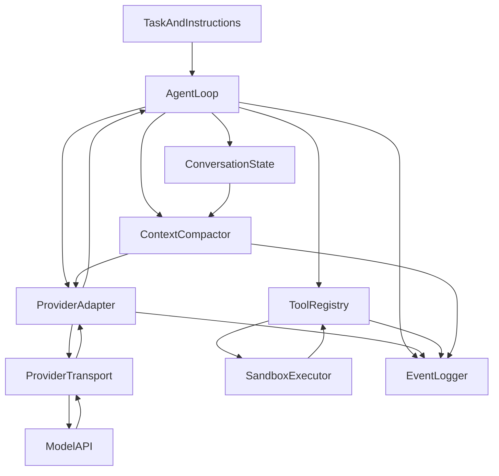

# Multi-Provider Agent API and Compaction Design

## Status and purpose

This is a reference architecture for an agent harness that can use multiple
models and provider APIs without spreading provider-specific conditionals
through the ReAct loop.

It is intentionally more general than the assignment implementation. The
assignment should remain small and testable; this document shows how that design
can evolve into a production-quality harness.

## 1. Design goals

- Keep the agent loop independent of any provider API.
- Preserve reasoning continuation state when a provider requires it.
- Support Chat Completions, Responses, Messages, and compatible local servers.
- Keep tool execution separate from model communication.
- Retain a canonical, auditable conversation without storing credentials.
- Compact old context without breaking tool-call/result groups.
- Allow provider-native or local model-generated compaction.
- Make every boundary unit-testable with recorded fixtures.
- Permit switching models after compaction when their capabilities differ.

## 2. Non-goals

- Exposing hidden chain-of-thought.
- Converting one provider's private reasoning format into another provider's
  reasoning state.
- Assuming that `reasoning`, `reasoning_content`, and Responses reasoning items
  are interchangeable.
- Letting model-written commands run in the local harness process.
- Treating logs as mutable conversation state.

## 3. Layered architecture



The central rule is that `AgentLoop` understands canonical turns and tool
requests, not provider request/response objects.

## 4. Canonical internal data model

Provider wire objects should be normalized at the adapter boundary. Preserve
opaque provider state separately rather than forcing it into plain text.

```python
from dataclasses import dataclass, field
from typing import Any, Literal


Role = Literal["system", "user", "assistant", "tool"]


@dataclass(frozen=True)
class ToolRequest:
    call_id: str
    name: str
    arguments_json: str


@dataclass(frozen=True)
class ToolResult:
    call_id: str
    name: str
    content: str
    is_error: bool = False


@dataclass(frozen=True)
class ReasoningState:
    provider: str
    endpoint: str
    replay_items: tuple[Any, ...] = ()
    visible_summary: str | None = None
    reasoning_tokens: int | None = None


@dataclass(frozen=True)
class CanonicalMessage:
    role: Role
    content: str | list[dict[str, Any]] | None
    tool_requests: tuple[ToolRequest, ...] = ()
    tool_result: ToolResult | None = None
    reasoning: ReasoningState | None = None
    provider_metadata: dict[str, Any] = field(default_factory=dict)


@dataclass
class ConversationState:
    system_message: CanonicalMessage
    task_message: CanonicalMessage
    active_history: list[CanonicalMessage] = field(default_factory=list)
    completed: bool = False
    step_count: int = 0
```

`ReasoningState.replay_items` is deliberately opaque. OpenAI encrypted
reasoning, DeepSeek `reasoning_content`, and Anthropic signed thinking blocks
must be replayed according to their own contracts, not interpreted by the core
loop.

## 5. Provider capability description

Do not infer every capability from the model name. Configuration or a one-time
probe should describe what the selected endpoint supports.

```python
@dataclass(frozen=True)
class ProviderCapabilities:
    api_family: Literal["chat_completions", "responses", "messages"]
    supports_tools: bool
    supports_parallel_tools: bool
    supports_reasoning: bool
    reasoning_field: str | None
    reasoning_replay_required_with_tools: bool
    supports_reasoning_summaries: bool
    supports_native_compaction: bool
    requires_alternating_roles: bool
    max_context_tokens: int | None
    max_output_tokens: int | None
```

Examples:

- OpenAI Responses: typed reasoning items, function-call items, optional
  provider-managed state, native compaction for supported models.
- DeepSeek Chat Completions: `reasoning_content` on assistant messages and
  strict replay requirements in thinking mode with tools.
- Modern vLLM Chat Completions: `reasoning`; behavior depends on reasoning
  parser, tool parser, and chat template.
- Anthropic Messages: signed thinking blocks and content-block tool calls.

## 6. Provider adapter interface

```python
from abc import ABC, abstractmethod


@dataclass(frozen=True)
class ModelRequest:
    model: str
    state: ConversationState
    tools: tuple[dict[str, Any], ...]
    reasoning_effort: str | None
    max_output_tokens: int


@dataclass(frozen=True)
class ModelTurn:
    assistant_message: CanonicalMessage
    usage: dict[str, int]
    raw_response: dict[str, Any]
    provider_state: Any | None = None


class ProviderAdapter(ABC):
    capabilities: ProviderCapabilities

    @abstractmethod
    def encode_request(self, request: ModelRequest) -> dict[str, Any]:
        """Convert canonical state and tools to provider request arguments."""

    @abstractmethod
    def decode_response(self, response: Any) -> ModelTurn:
        """Normalize provider output without losing replay-required state."""

    @abstractmethod
    def encode_tool_results(
        self,
        turn: ModelTurn,
        results: list[ToolResult],
    ) -> list[Any]:
        """Create provider-specific continuation items/messages."""

    @abstractmethod
    def sanitize_for_log(self, value: Any) -> dict[str, Any]:
        """Return a JSON-safe object with credentials and sensitive headers removed."""
```

Adapter implementations can include:

```text
ChatCompletionsAdapter
OpenAIResponsesAdapter
DeepSeekChatAdapter
VllmChatAdapter
AnthropicMessagesAdapter
```

Avoid a single adapter with many `if provider == ...` branches. Separate classes
make provider-specific replay rules explicit and independently testable.

## 7. Transport layer

The transport owns network behavior, not semantic conversion.

```python
class ModelTransport(ABC):
    @abstractmethod
    def send(self, encoded_request: dict[str, Any]) -> Any:
        """Perform one API request and return the SDK response."""


class OpenAITransport(ModelTransport):
    def __init__(self, client: Any, api_family: str):
        self.client = client
        self.api_family = api_family

    def send(self, encoded_request: dict[str, Any]) -> Any:
        if self.api_family == "responses":
            return self.client.responses.create(**encoded_request)
        return self.client.chat.completions.create(**encoded_request)
```

The transport can implement:

- retry and timeout policy,
- streaming assembly,
- cancellation,
- rate-limit handling,
- request IDs and latency metrics.

The adapter should remain responsible for semantic fields such as reasoning and
tool-call replay.

## 8. Model gateway

The gateway combines adapter and transport while preserving both canonical and
raw records.

```python
class ModelGateway:
    def __init__(
        self,
        adapter: ProviderAdapter,
        transport: ModelTransport,
        events: "EventLogger",
    ):
        self.adapter = adapter
        self.transport = transport
        self.events = events

    def complete(self, request: ModelRequest) -> ModelTurn:
        encoded = self.adapter.encode_request(request)
        self.events.request_started(
            self.adapter.sanitize_for_log(encoded)
        )
        raw = self.transport.send(encoded)
        turn = self.adapter.decode_response(raw)
        self.events.request_completed(turn.raw_response, turn.usage)
        return turn
```

This gives the rest of the program one model-call method without hiding the
provider boundary.

## 9. Tool registry and execution

Tool schemas, argument validation, dispatch, and isolation should be one
subsystem.

```python
@dataclass(frozen=True)
class RegisteredTool:
    name: str
    canonical_schema: dict[str, Any]
    handler: Any


class ToolRegistry:
    def register(self, tool: RegisteredTool) -> None:
        ...

    def schemas_for(self, adapter: ProviderAdapter) -> tuple[dict[str, Any], ...]:
        """Let the adapter translate canonical schemas for its API."""

    def execute_all(
        self,
        requests: tuple[ToolRequest, ...],
    ) -> list[ToolResult]:
        """Return one linked result per request, including recoverable errors."""
```

Execution policy:

- Validate JSON and argument types before invoking handlers.
- Never discard an item from a parallel call batch.
- Return unknown/malformed calls as linked recoverable errors.
- Run untrusted commands in a sandbox.
- Treat a dead sandbox as terminal rather than endlessly returning errors.
- Keep tool outputs bounded before adding them to context.

## 10. Provider-neutral agent loop

```python
class AgentLoop:
    def __init__(
        self,
        state: ConversationState,
        gateway: ModelGateway,
        tools: ToolRegistry,
        compactor: "ContextCompactor",
        events: "EventLogger",
        step_limit: int,
    ):
        self.state = state
        self.gateway = gateway
        self.tools = tools
        self.compactor = compactor
        self.events = events
        self.step_limit = step_limit

    def run(self) -> None:
        try:
            while not self.state.completed:
                if self.state.step_count >= self.step_limit:
                    raise StepLimitError(self.step_limit)

                self.compactor.maybe_compact(self.state)

                request = self.build_model_request()
                turn = self.gateway.complete(request)
                self.state.step_count += 1
                self.state.active_history.append(turn.assistant_message)

                calls = turn.assistant_message.tool_requests
                if not calls:
                    continue

                results = self.tools.execute_all(calls)
                self.append_tool_results(turn, results)
                self.apply_completion_signals(results)
        finally:
            self.events.flush()
            self.stop_environment()
```

The loop orchestrates policy but does not:

- parse provider response objects,
- execute shell commands directly,
- write provider-specific reasoning fields,
- decide how summaries are prompted.

## 11. Context accounting

Use the provider's latest token usage as an anchor, then estimate only material
added since that request. A robust counter tracks:

```python
@dataclass
class UsageAnchor:
    history_fingerprint: str
    provider_input_tokens: int
    provider_output_tokens: int
    estimated_tokens_added_after_anchor: int = 0
```

If the history fingerprint no longer matches because of compaction or manual
rewind, discard the anchor and estimate the current prompt from scratch.

Account for:

- system/developer instructions,
- active conversation,
- tool schemas,
- skill catalog,
- multimodal inputs,
- requested output headroom,
- provider-specific hidden prefixes when known.

## 12. Compaction interface

```python
@dataclass(frozen=True)
class CompactionPlan:
    old_prefix: tuple[CanonicalMessage, ...]
    retained_tail: tuple[CanonicalMessage, ...]
    estimated_tokens_before: int
    target_summary_tokens: int


@dataclass(frozen=True)
class CompactionResult:
    working_memory: CanonicalMessage
    retained_tail: tuple[CanonicalMessage, ...]
    raw_summary_response: dict[str, Any]
    estimated_tokens_after: int


class ContextCompactor(ABC):
    @abstractmethod
    def maybe_compact(self, state: ConversationState) -> bool:
        ...

    @abstractmethod
    def plan(self, state: ConversationState) -> CompactionPlan | None:
        ...

    @abstractmethod
    def compact(self, plan: CompactionPlan) -> CompactionResult:
        ...
```

Separating `plan()` from `compact()` permits unit tests for turn-boundary
selection without making API calls.

## 13. Local model-generated compaction

`ModelSummaryCompactor` should:

1. Trigger below the provider's hard context limit with output headroom.
2. Split only at complete interaction boundaries.
3. Protect stable instructions and the original objective.
4. Keep a recent tail by token budget, with a minimum number of complete turns.
5. Include previous working memory in later re-compactions.
6. Summarize old messages, tool observations, tests, edits, failures, and next
   action.
7. Insert one clearly labelled working-memory message before the retained tail.
8. Verify that the resulting context is materially smaller.
9. Preserve the pre-compaction record in the event log.

Do not retain half of:

- an assistant tool-call batch,
- its corresponding tool results,
- a provider-required reasoning/function-call continuation group.

## 14. Provider-native compaction

A separate implementation can use a provider compaction endpoint when enabled:

```python
class NativeProviderCompactor(ContextCompactor):
    ...
```

This implementation must declare that its checkpoint may not be portable to a
different provider. Opaque compacted or reasoning state should never be assumed
to work with another model family.

Use local model-generated summaries when:

- provider portability matters,
- the endpoint lacks native compaction,
- summaries must be human-auditable,
- deterministic logging is required.

Use native compaction when:

- the provider guarantees reasoning-state continuity,
- lower latency/cache reuse outweighs portability,
- opaque checkpoint retention is acceptable.

## 15. Role and message-template compatibility

Canonical history can contain adjacent user messages. If a model server's chat
template requires strict alternation, the adapter can merge adjacent compatible
messages for that request while leaving canonical history unchanged.

```python
class VllmChatAdapter(ProviderAdapter):
    def encode_request(self, request: ModelRequest) -> dict[str, Any]:
        messages = merge_adjacent_roles_if_required(
            canonical_messages(request.state),
            required=self.capabilities.requires_alternating_roles,
        )
        ...
```

Never mutate the original task just to satisfy one provider's template.

## 16. Reasoning-state rules

The adapter must classify returned reasoning as one of:

- not returned: only a usage count exists,
- visible summary: safe to log as text,
- replay-required plaintext: retain with access controls,
- replay-required opaque/encrypted state: preserve unchanged,
- signed block: preserve content and signature unchanged.

Logging and replay are different decisions. A service can retain opaque
reasoning for replay while redacting it from ordinary operator logs.

Compaction policy:

- Old visible reasoning can be summarized into decisions and evidence.
- Old opaque reasoning can be dropped only with the complete turns it belongs
  to, unless the provider supports compacting it.
- Recent replay-required reasoning/function/tool groups remain intact.
- Never translate opaque reasoning across providers.

## 17. Event logging

Use append-only typed events rather than one mutable log object:

```python
class EventLogger:
    def request_started(self, sanitized_request: dict[str, Any]) -> None:
        ...

    def request_completed(
        self,
        sanitized_response: dict[str, Any],
        usage: dict[str, int],
    ) -> None:
        ...

    def tool_completed(self, result: ToolResult) -> None:
        ...

    def compaction_completed(
        self,
        plan: CompactionPlan,
        result: CompactionResult,
    ) -> None:
        ...

    def run_failed(self, exc: BaseException) -> None:
        ...

    def flush(self) -> None:
        ...
```

Every event should include:

- session and step IDs,
- timestamp,
- provider/model/API family,
- request/response linkage,
- normalized usage,
- duration and retry count,
- compaction before/after estimates,
- tool call ID and result status.

Never log:

- API keys or authorization headers,
- environment secrets,
- unrestricted command environments,
- raw reasoning when policy forbids it.

## 18. Persistence schema

Persist three distinct views:

1. Canonical active state used for the next request.
2. Raw sanitized provider records for debugging and replay analysis.
3. Append-only events for usage, timing, tools, and compaction.

Do not derive active state by mutating the latest request log. Audit records can
outlive compaction and remain evidence of what was actually sent.

## 19. Configuration

```yaml
provider:
  name: openai
  api_family: responses
  base_url_env: OPENAI_BASE_URL
  api_key_env: OPENAI_API_KEY

model:
  name: gpt-5.6-luna
  reasoning_effort: xhigh
  reasoning_summary: auto
  max_output_tokens: 4096

context:
  compact_at_tokens: 120000
  retain_recent_tokens: 15000
  retain_min_complete_steps: 1
  summary_max_tokens: 1200
  compaction_mode: local

logging:
  raw_provider_records: true
  include_visible_reasoning_summaries: true
  include_opaque_reasoning: false
```

Configuration validation should reject incompatible combinations before a long
agent run, such as Chat Completions plus tools plus unsupported reasoning effort.

## 20. Capability probing

A cheap startup probe should verify the actual combination being used:

- endpoint/API family,
- model,
- tool schema,
- reasoning setting,
- response field names,
- parallel tool behavior.

Cache probe results by provider host, model, and relevant server version.
Explicit configuration should remain available because capability inference can
be wrong for gateways and model aliases.

## 21. Test strategy

### Unit tests

- Canonical turn grouping and tool-result linkage.
- Each adapter's tool-schema conversion.
- `reasoning` versus `reasoning_content` retention.
- Responses reasoning/function-call item replay.
- Adjacent-role normalization for strict chat templates.
- Compaction split boundaries and repeated compaction.
- Empty summaries and ineffective compaction.
- Credential redaction.

### Contract fixtures

Store sanitized response fixtures from:

- OpenAI Responses,
- OpenAI Chat Completions,
- DeepSeek thinking with tools,
- vLLM Qwen reasoning with tools,
- Anthropic thinking with tools.

Run all fixtures through `decode_response()` and assert the same canonical
invariants.

### Live probes

Live tests should be opt-in and clearly marked billable. They should use tiny
prompts, deterministic local tools, distinct output logs, and no credentials in
artifacts.

### Failure tests

- Provider timeout after a compaction.
- Missing reasoning replay item.
- Duplicate call IDs across different turns.
- Multiple calls with one malformed argument set.
- Tool process failure versus dead sandbox.
- Compaction summary larger than replaced context.
- Logging failure during environment cleanup.

## 22. Suggested package layout

```text
agent_harness/
  core/
    loop.py
    messages.py
    state.py
    usage.py
  providers/
    base.py
    capabilities.py
    openai_chat.py
    openai_responses.py
    deepseek_chat.py
    vllm_chat.py
    anthropic_messages.py
  tools/
    registry.py
    schemas.py
    sandbox.py
  compaction/
    base.py
    planner.py
    model_summary.py
    native_provider.py
  logging/
    events.py
    redaction.py
    trajectory.py
  tests/
    fixtures/
    test_adapters.py
    test_compaction.py
    test_loop.py
```

## 23. Migration path from this assignment

The assignment already establishes useful boundaries:

- `Agent.run()` is the orchestration loop.
- `build_prompt()` assembles active state.
- `query_language_model()` is the model-call boundary.
- `process_response()` normalizes an SDK response.
- `execute_tool_calls()` is domain-specific dispatch.
- `compact_context()` performs summary replacement.
- `api_prompts`, `api_responses`, and `compaction_events` form an audit trail.

A practical migration sequence:

1. Extract `query_language_model()` and `process_response()` into one
   `ChatCompletionsAdapter` plus transport.
2. Replace raw dict tool calls with canonical `ToolRequest` and `ToolResult`.
3. Extract tool registration and validation from `CodeAgent`.
4. Split compaction boundary selection from summary generation.
5. Replace direct JSON trajectory writing with typed append-only events.
6. Add `OpenAIResponsesAdapter` using the tested lesson script as a fixture.
7. Add DeepSeek/vLLM adapters only after obtaining real sanitized fixtures.

Do not generalize the assignment prematurely. The small current design is
appropriate for learning and grading; adapters become valuable when the same
loop truly needs to serve incompatible provider contracts.

