## Long Context, Management and Agents
Majority of the agent context is system+tool call defs, tool calls called by it and tool call results unlike normal llms where majority is reasoning and answering the user
Two inherent challenges at long context
- Model related: where the model needs to handle long context effectively and be able to navigate through it, picking the evidence, not forgetting etc
- Inference related: Systems side issues like memory, caching, compaction algo/state, latency etc 

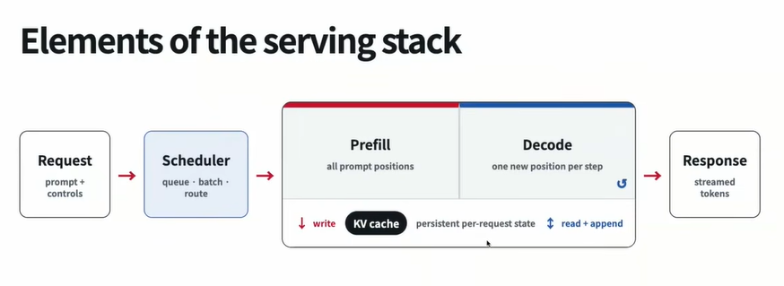
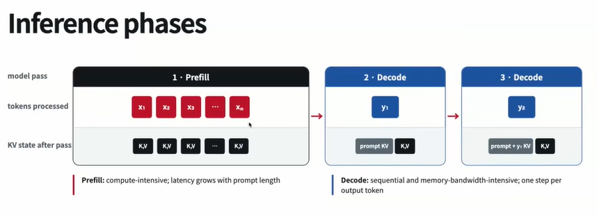

Metrics
- TTFT (Time to first token): Time taken to generate the first token, typically measures the efficiency of the prefill phase
- TPOT (Time per output token): Time taken to generate each output token, typically measures the efficiency of the decode phase. Time between each token
- Throughput (Tokens per second): Number of tokens generated per second, typically measures the efficiency of the entire serving stack
- Cost per token: Cost of generating each token
- Memory usage: Memory usage of the full inference stack, typically measures the efficiency of the entire serving stack

Depending on the task at hand, we might be interested in different metrics. For live interaction, we might be interested in TTFT and TPOT, for batch processing, we might be interested in throughput and cost per token while for background and long running tasks we might be interested in memory usage and cost per token but not TTFT and TPOT

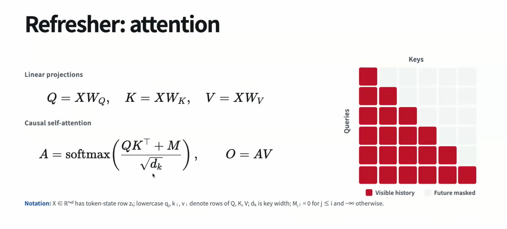

*Long context rot* is a big problem in agentic settings because user instructions can come anytime and it needs to remember those for the full work cycle

Dealing with long context
- Architecture level
- Trainign level

#### Architecture level
We wanna move from O($n^2$) (global nxn, full scale) to lesser complexity (at the architectural level, full attention is being replaced with sparse attention etc)
- Sliding window types $\implies$ O(wn) where w is the window size
- Periodic Local + Global, few sliding window based followed by one global full scale update
    - Gated Detla Net in Qwen
    - Kimi Delta Attention
    - Mamba 2
    - QSA Sparse retrieval, dense gated mla, dense gqa

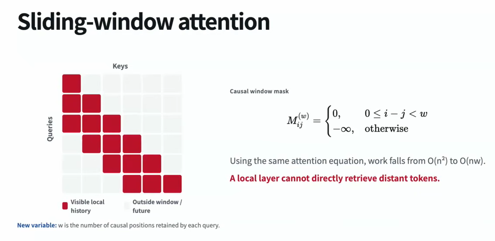

To Linear Attention
- Standard softmax to Linear Attention: We are trading off representational expressiveness for efficiency by removeing the softmax, which is like a probability map and directly use the unnormalised map $QK^T$. The model should now learn more additionally since its less expressive
- Linear Attention to DeltaNet: Trying to add proxies to Linear Attention to make it more expressive. Pushing in the directoin of update that we want, trying to make it a better predictor. 
- DeltaNet to Gated DeltaNet: Decaying the past context while computing for this step. This is to mitigate any issues from previous context
- Gated DeltaNet to KDA: Per-term decay, giving it more freedom

Sparse Attention: Not attending to everything from the previous context, only attending to some things from the previous context. Can be fixed patterns, content dependant etc

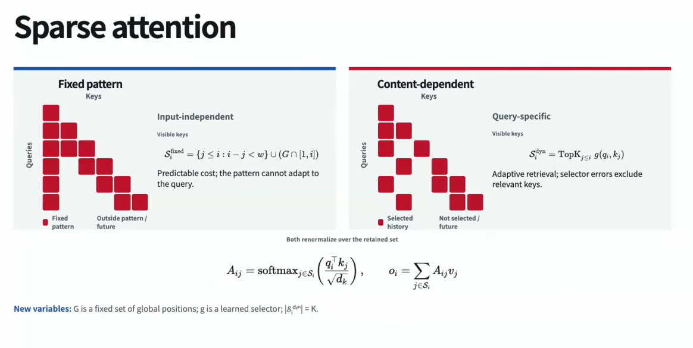
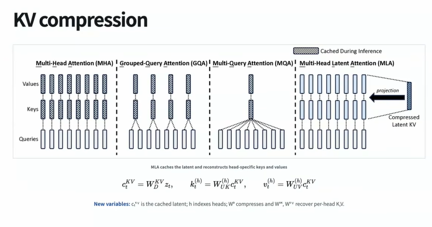

### Training Level
Long organic data isnt readily available to train directly. Typically traces and synthetic corpora is used for this purpose
Sequential training is used, short->32k->long context. Packing wont help here since the context is too long and the model needs to remember it for the full work cycle

Positional encoding is required because attention computation is token position invariant, like permuting tokens doesnt change the attention computatoin value between them if positional encoding is not used. Another reason is that score for (This, cat) pair in "This is a cat" and "This is not a cat" would be the same if we dont use positional encoding, and also if they're present in the same sentence like "This is a cat but this is not a cat" would have the same score for (This, cat) pair.

Advantage of using RoPE for positional encoding is that attentino between two tokens is completely determined by their relative position and doesnt involve any avsolute position information unlike the standard sine/cosine positional encoding used in transformers paper (when expanding $QK^T$ here, we do get absolute position terms unlike RoPE). 

But NoPE (No Positional Encoding) also works because we do causal masking while attention computation, so it could bring in some form of positional information in auto-regressive transformers but in other forms where computaiotn happens at once, it doesnt work

Scaling to long context
- RoPE scaling: The rope parameter $\theta$ is scaled so that longer context can be incorporated directly. So a model trained for context C, if we want to extend it to context L, the positoinal encoding is scaled by $\frac{C}{L}$ so that relative positoin L (tokens at pos 1, L) appear as C, which is in the already trained limit
- YaRN: Similar in inspiration to KDA, like we want some positions to scale more some scale less etc

### KV Caching

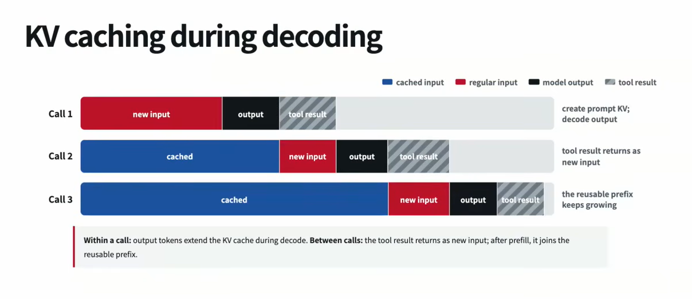

vLLM:
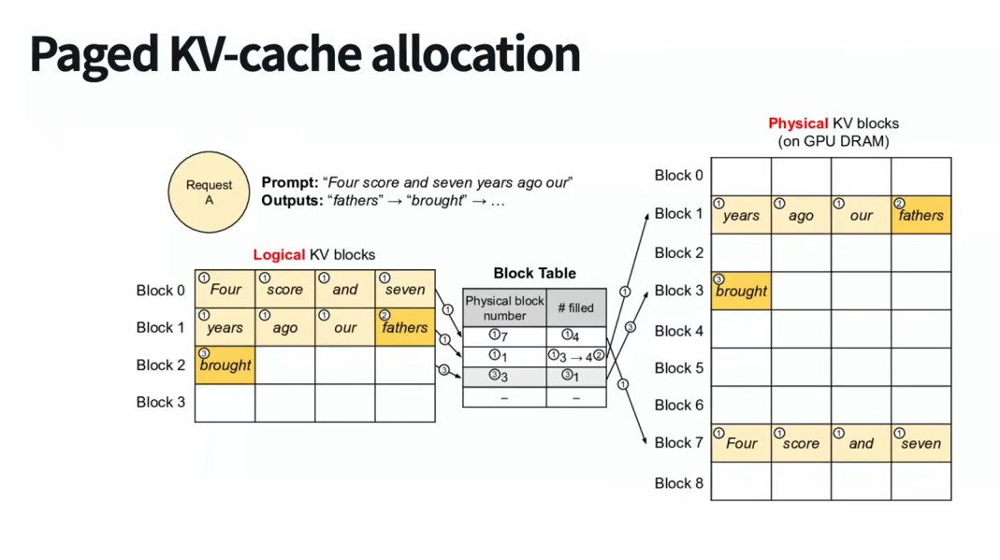

sglang:
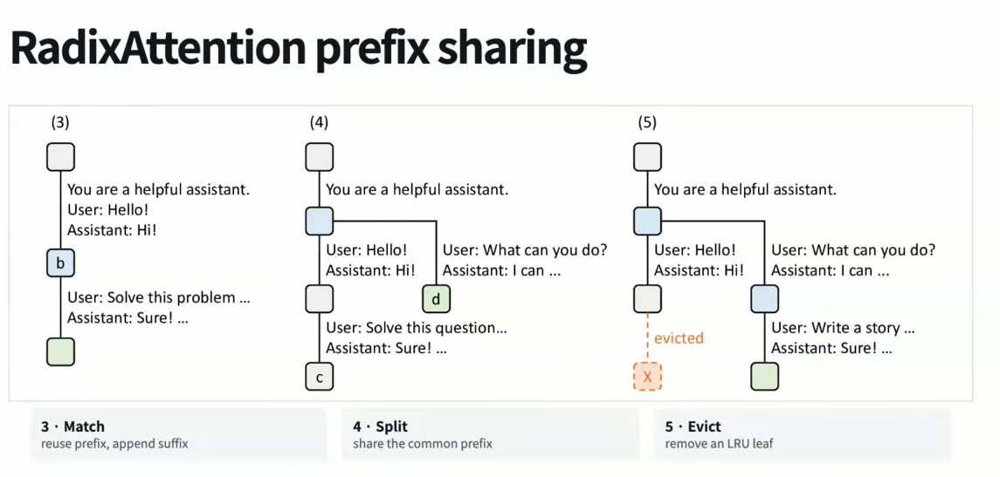
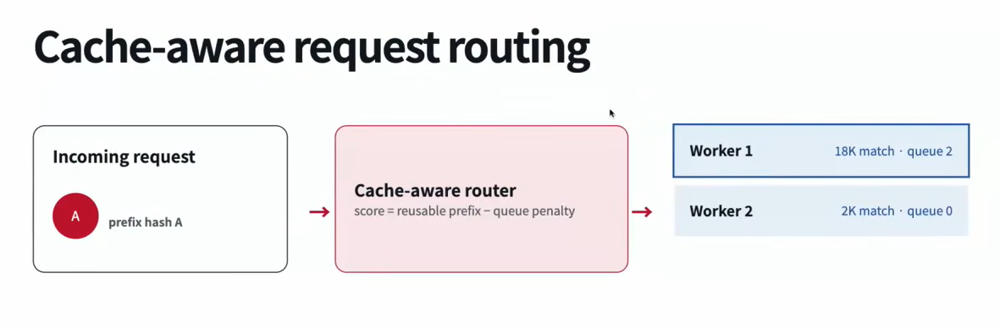

Cache hit rate depends on the algos the model provider uses for **cache aware routing** and **cache eviction**. So the total task cost depends on the cache hit rate by a large margin. The way we manage cache memory is a really good research problem in itself. Depending on hardware, L1/L2 cache things in cache! Lol  

Because cached prompt cost is less, we should target it as much as possible and try to reduce the number of tokens that are not cached
- Stabilising the prefix like not using current date/time in the system prompt and always keeping the system prompt constant to reduce the cost, tool call definitions etc
- Only appending new things without editing the older ones
- Measuring the eviction/cache hit so that we can optimize the cache usage and reduce the cost

### Context Compaction
Summarizing/crushing the previous context into a smaller context. This is really crucial because if we miss out on some small details, it can lead to big problems.

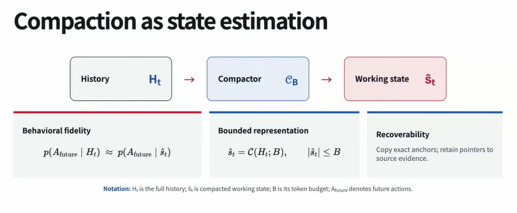

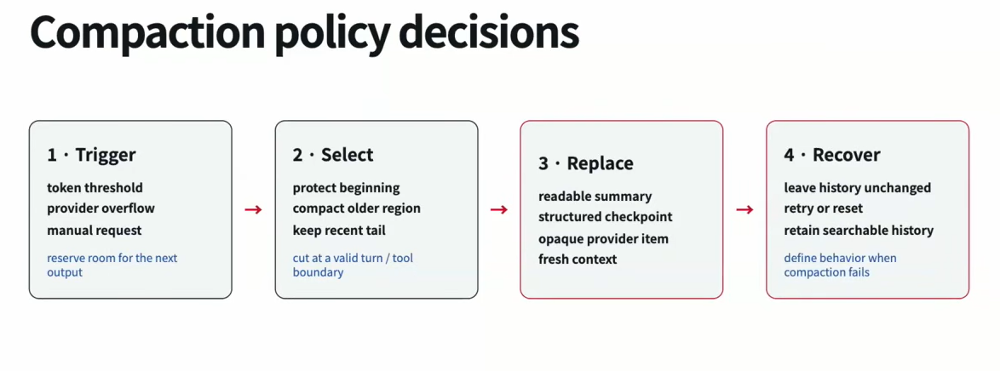

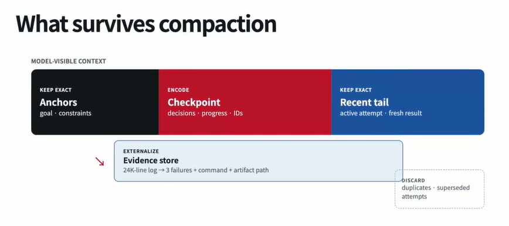
The coding agent's histroy will anyway get logged somewehre, so we can even let it know that this is the place that the context is there and we can let it read that if requried

Repeated compaction can cause drift in the agent behaviour loosing important things over series of compaction rounds because of summaries and not exact context

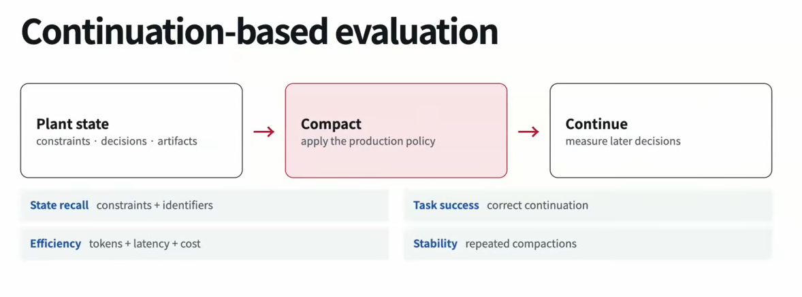
Its not enough to jsut measur the final benchmark eval for evaling our compaction algo, we need to also measure the intermediate results to see if the compaction algo is working as expected and not causing any issues.