## Memory and Skills
Going beyond model adn context!

Utilising file system and other things to equip the models with things across and within task to store information and perform better at tasks

Why re-usable memory/skills are even required? Lot of things and tasks do share similar patterns and workflows to complete the tasks and the agents should be able to reuse these patterns and workflows to complete the tasks faster and more efficiently instead of having to start every task from scratch despite the task being similar to the previous one it already solved

Lot of shared structure recurs, so the way we represent these (as text or code blackbox) and how the agent can use them and when should this experience be used/how this should be updated etc are all important questions to answer

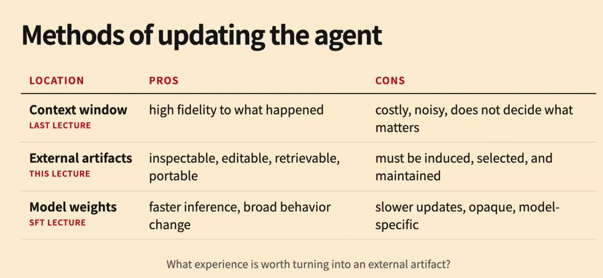

External artifacts are more inspectable and traceable, and can be written by us, like an interface between a person and system while model training are very specific to the model and its not inspectable adn it doesnt transfer from one system to other unlike the skills (external artifacts) which can be shared and reused across different systems and tasks
- Some issues while agents write skills is they tend to be overly verbose and sometimes misinterpret the task at hand

#### Types of experience
- Episode: Full trajectory, costly but offers the most complete information
    - Useful only for very specific tasks and situations where the agent needs to reuse a complete exact thing of the sequence of the task and the environment
- Facts: Specific facts and info about the given task and situation
    - Useful if the fact recurs in future tasks
- Skills: Reusable patterns and workflows to complete the tasks. Like on how do we do the task but without too much specific details. Specific actions to take etc
    - Useful if the workflow recurs in future tasks

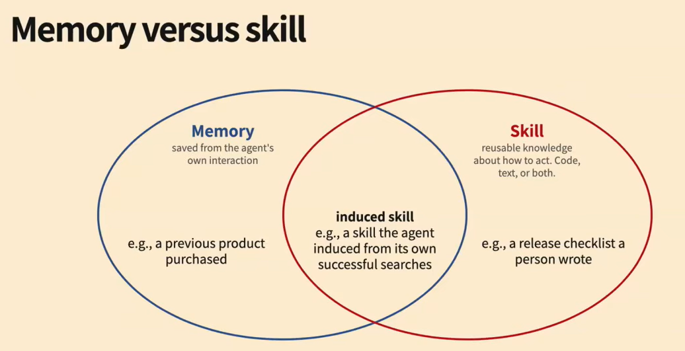

Whenever we repetitivley keep writing soem instructions, we cna package that as a skill and have it pulled up when that task is to be done and it acts as the guidance and may be rules on how to do the task

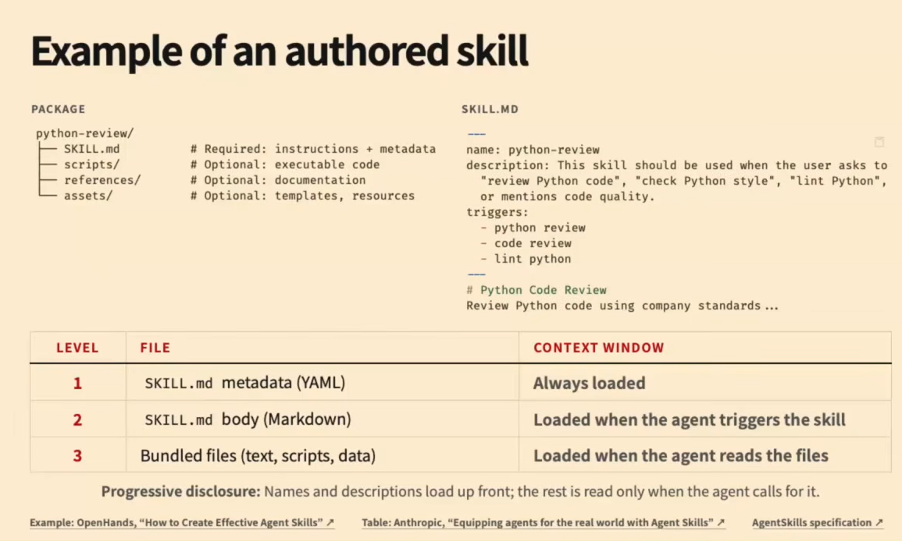

Having lot of skills and loading them all at once despite short yaml descriptions can hurt performance. Even having irrelevant skills can also hurt performance because of them occupying a lot of context space

Usually progressive disclosure is employed, available skills and short descriptions of what they do. Then the model can use tool calls to open and view the available skills etc

We should **evaluate the performance of the agent with and without skills to see the difference and how much it helps the agent perform better** if it helps at all. Even combination of skills and not just from a sole skill etc. It also depends on the model and harness whether it can make use of the skills we provided

Tasks that require $<4$ skills seem to benefit more and also shorter skill.md files seem to benefit more

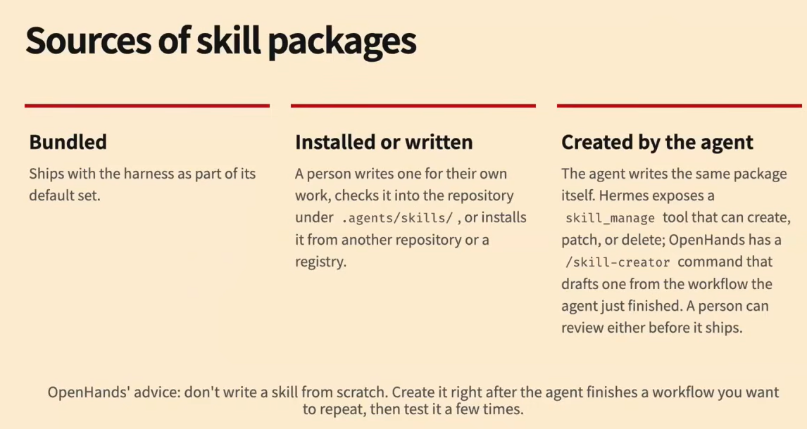
Its always better to write skills after performing the task wihtout the skill, checking the trajectory and then writing the skill.md file to capture the pattern and workflow of the task and testing it several times to make sure it works as expected and then using it in the future tasks. We shouldn't base the skills on one specific instance but should be generalisable acorss instances of the task

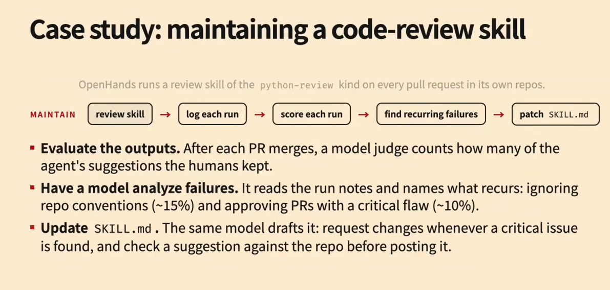

### Memories
On how to store and retrieve text/memory to help the agent perform better at tasks and memory management
Using external memory 

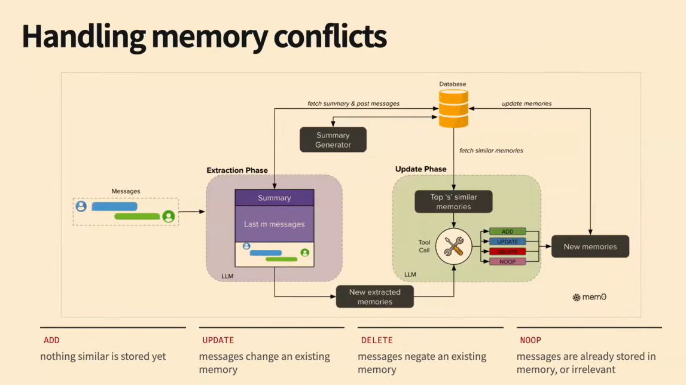
This is like a text based analog of deltaNet

**Feedback on trajectories and also previous trajectories** can be useful for agents for them to learn and improve from their mistakes and improve their performance over time. This can also be used to improve performance across a similar cluster of tasks like stroing all the trajectories and feedback of each trajectory in a db and fetching similar trajectories for a given task and conditioning the agent/llm on it. Like RAG but for agents

Papers like SkillOPT and the skills paper from nvidia on robot skills are really good illustrators of constructing re-usable subtasks as skills -- code as actions etc ideas exist from 2023 itself!

This can also be used in the online setting where the agent improves on the go as the tasks keep coming one at a time (ofc all these things will only be useful if there's some re-usable property or takeaway from the previous tasks)

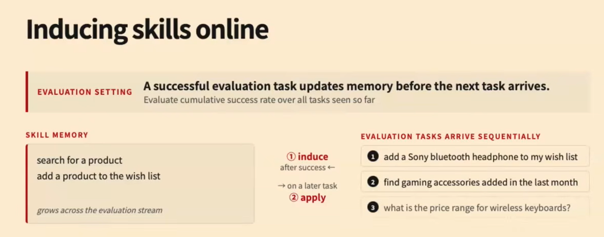
We would typically want to induce only the potential resusable things (like either code/tool calls etc) into skills

If there a lot of skills, then we might want to delete irrelevant skills or the skills that are very specific but arent generalisable etc

Skills can be implemented as both text/code.

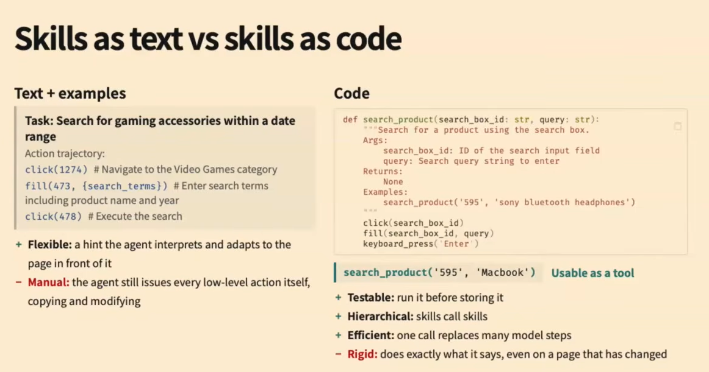
Code skills also exploit the fact that LLMs are very good code generators

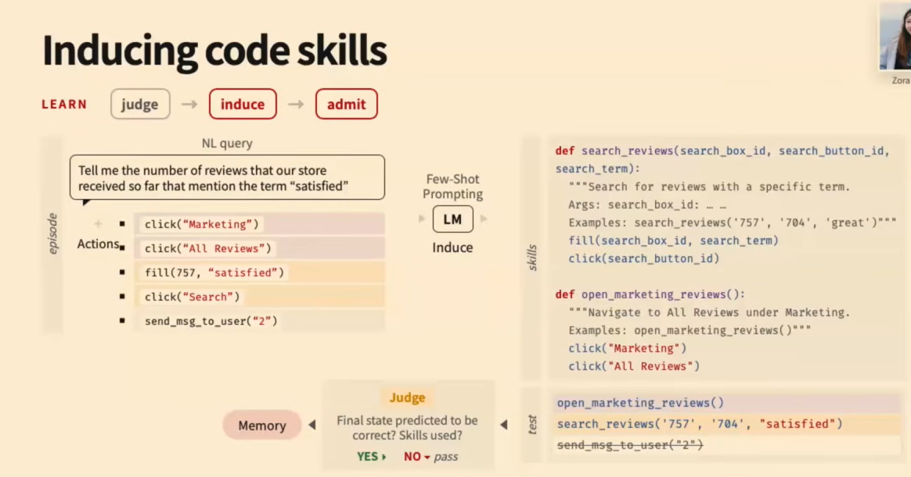
Code skills also give us the ability to execute and test then directly. Sort of in the reflexion type way, get it tested and use the feedback to improve the skill. However, code skills are rigid
In additino, code skills reduce the number of steps and task success rates compared to text skills (though both are better than without skills at all)

Skills written for one set of tasks may not work on other set of similar tasks if the specific mechanisms are different. This can be resolved by first writing an abstract code skill and then instantiate it for every specific mechanism task and have specific code skills

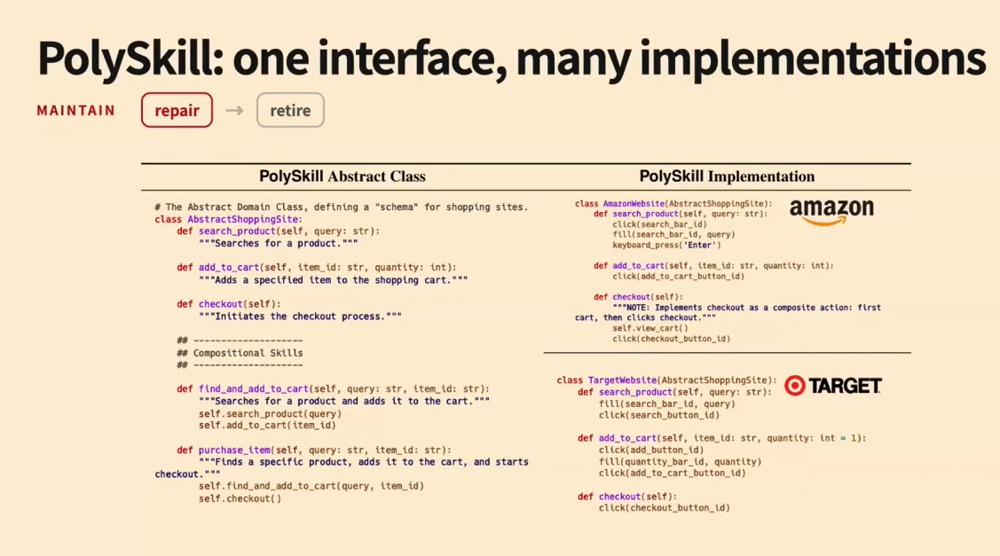

### Skill lifecycles

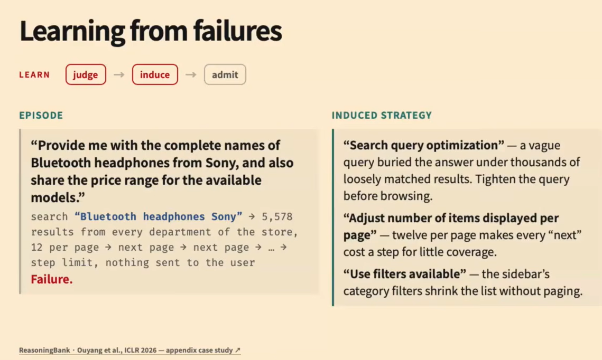
Learning from failures. This can be helpful when inducing strategies but less helpful with trajectories or workflows (demostrations of what not to do might hurt?). Judge model accuracy also matters a lot because it decides what to include and what not to include! "Simulated judge accurary" to test the judge (ReasoningBank paper)

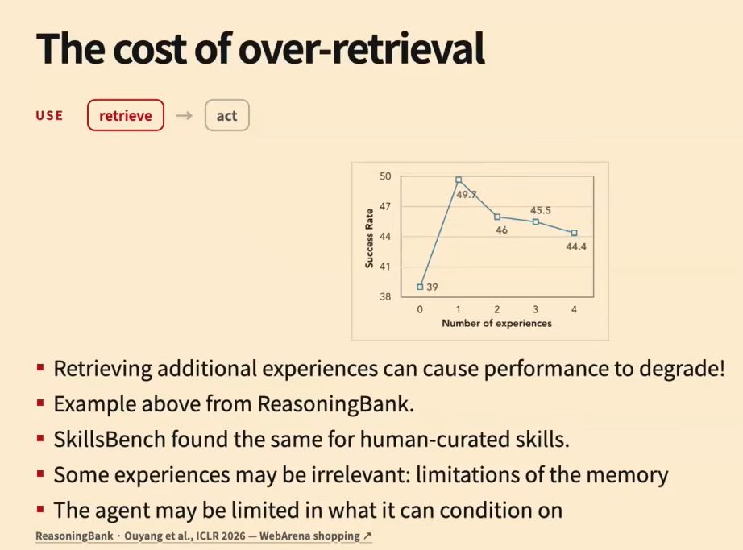
Could be because the underlying model hasnt been trained on navigating lot of skills hence gets distracted because of the context

Memory consolidation by removing irrelevant skills and keeping only the most relevant ones could help -- can use something like num times used across tasks and evicting it to reduce the memory so that the model can perform better

Training the skill inducer/skill induction model/judge model because skill file contents depends on this specific model. Despite the complexity associated with this process, we can still use RL to train these models on skill induction etc (non-differentiable broken tasks can also be RL'ed!!)

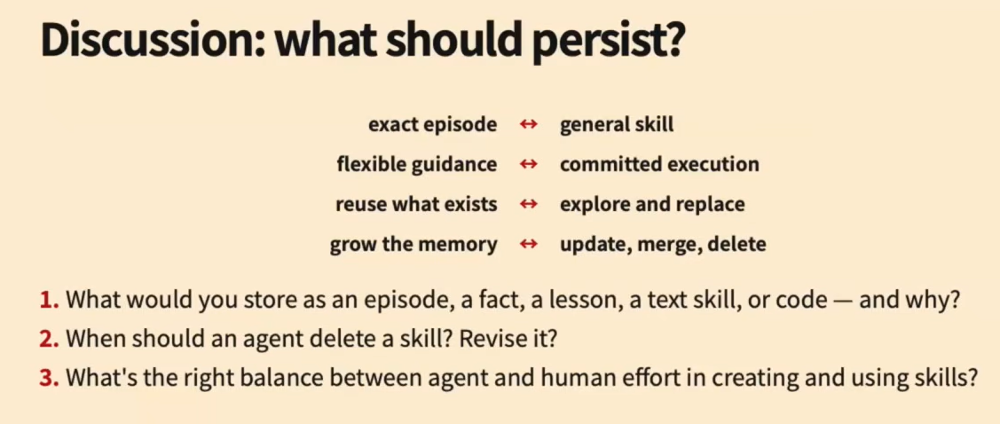