Planning is going to be an artifact, something like context, which should tell or inform it what it should do and also inform it what to do in the future as well. It should also specify hwo to react to feedback from the environment, should be able to ask for feedback from the human in case of ambiguities and also be able to edit the plan based on the feedback from the environment.

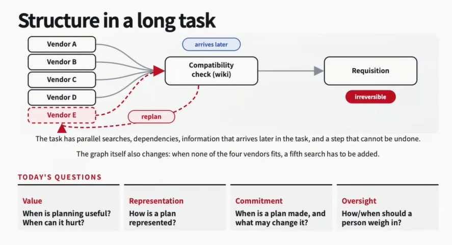

When we are going to perform a non-trivial task or long horizon task, its usually better to use plannning to structure the process, even if the plan is not perfect and take it to the end, but could help in making the process more efficient and effective. This also helps perform the task in parallel using multiple subagents etc. GIven a good plan, we can also use a weaker and cheaper agent to perform the task, saving on cost.
It also serves like a scratchpad for the agent and human to steer towards performing the tasks with steps and all. Also helps agent to keep track of the progress on what was done and what needs to be done etc

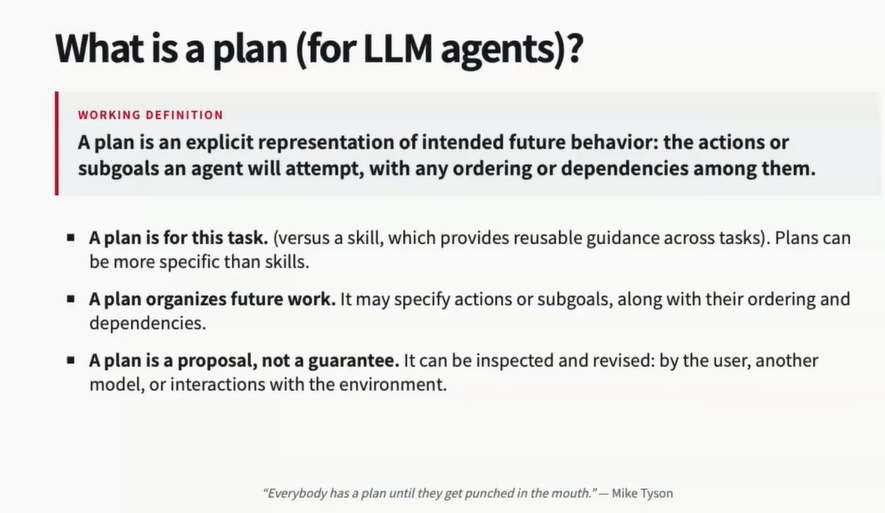
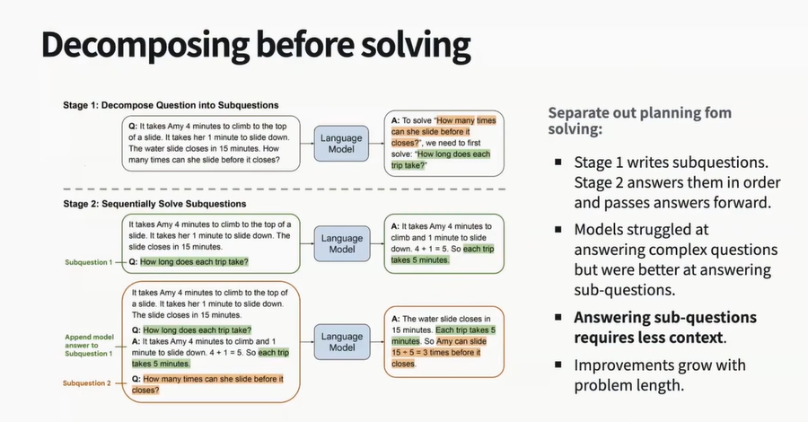

Decomposition also brings in modularity. Each subtask can be solved by a different model, can train specialised task models to invoke, also helps in reducing total cost. Can train a specialised task decomposition model to decompose the task after using a powerful frontier llm/agent etc

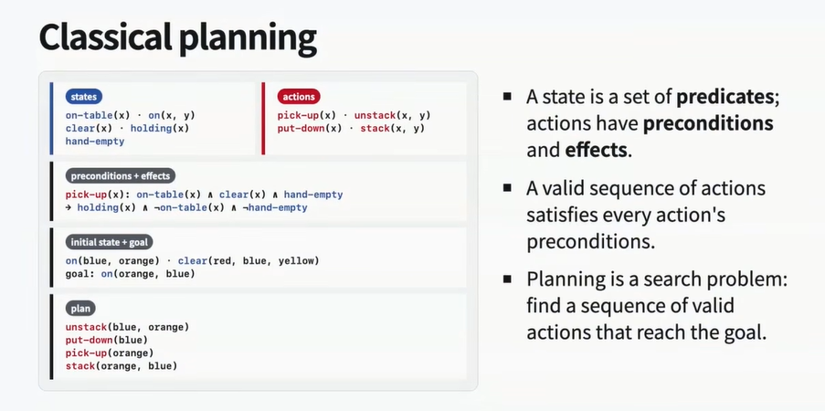
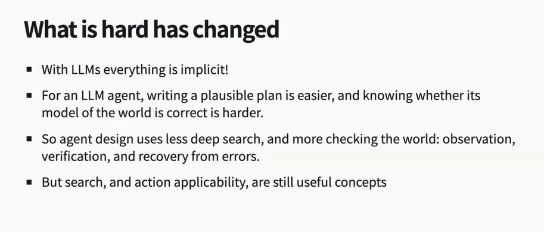
For llm planning, planning is less about search algo while more about making it executable and usable. LLM plans are also not checkable and are general, as in they're strings and to understand what an action does to an environemtn (liek code edit), it needs to execute and get feedback from the environment.

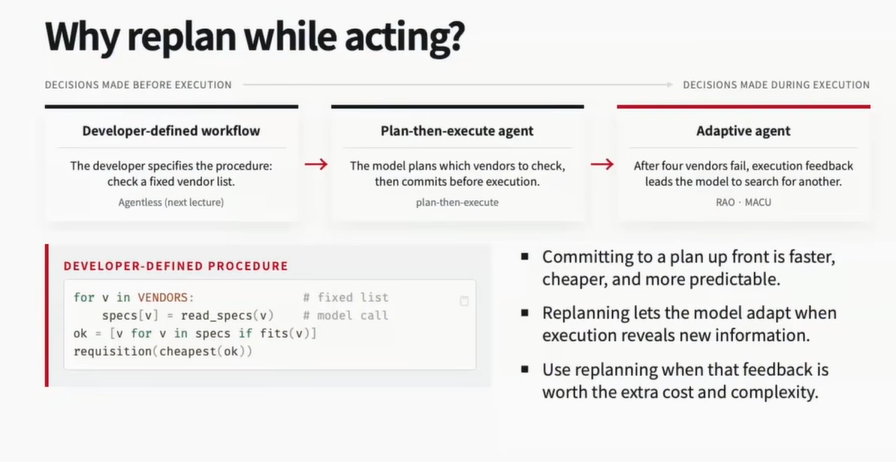
But as agents get stronger, we can relax a lot of scaffolding as these frontier agents dont require a lot of scaffolding/constraining. 

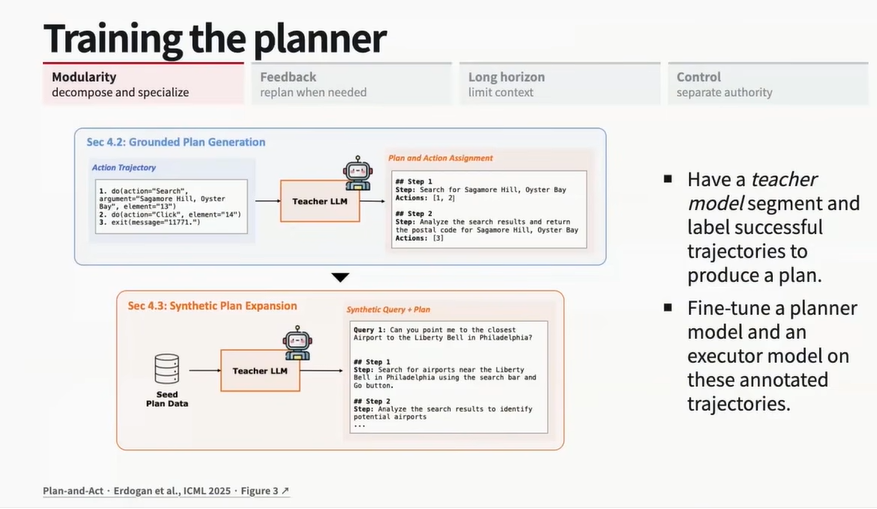
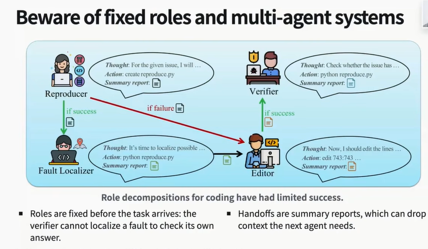

More than scaling reasoning for planning, replaning by interacting with the environment would be more helpful given a same token budget.
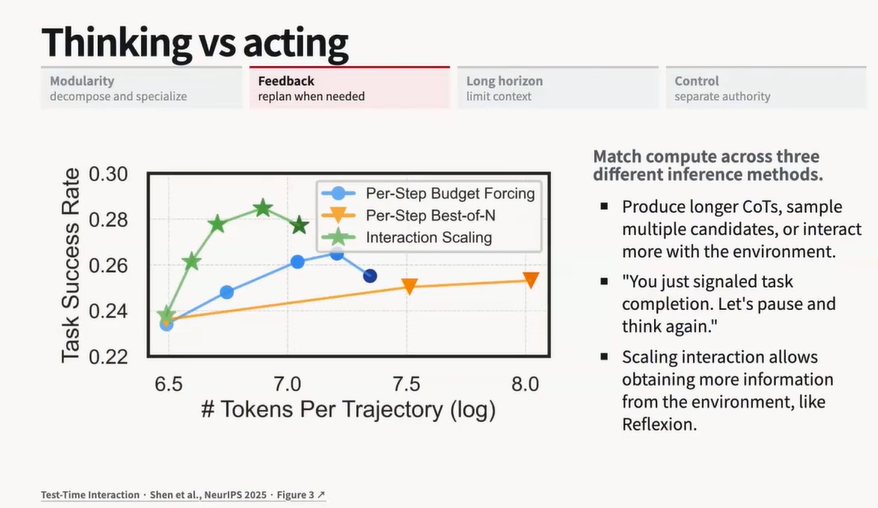
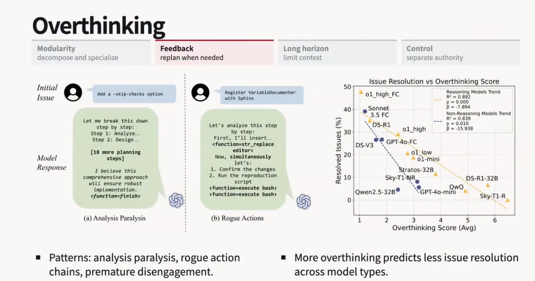

So dont want to spend too much time planning, but replanning is also equally important.

Planning also helps track state overtime. Though frontier models are becoming good at inherently tracking state, but they still lack when it exceeds some context limit and cant track for infinite time.

Bad initial context will result in bad otuput later on as well, because if any article has really good content in the beginning, its more likely that the remaning of hte article would also be good while if the initial part is relatively bad, its more likely that the remaining part would also be bad.

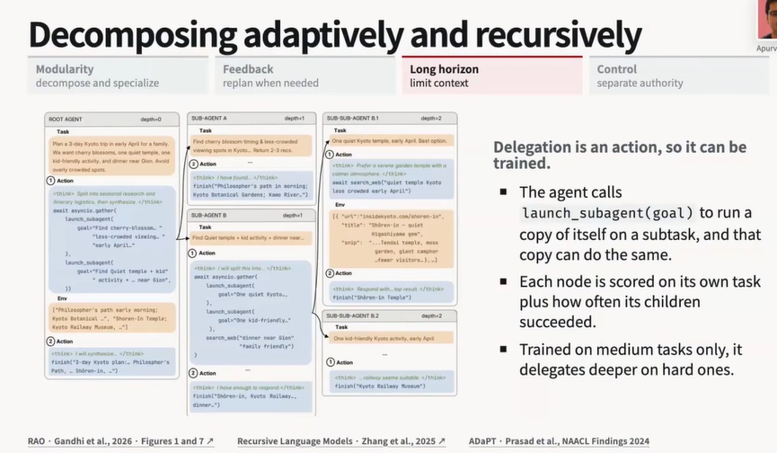

Plans can also be used to make our systems more robust

In a nutshell, planning not only helps in making the system more efficient and effective, but also helps in making it more robust and adaptable keeping human in the loop

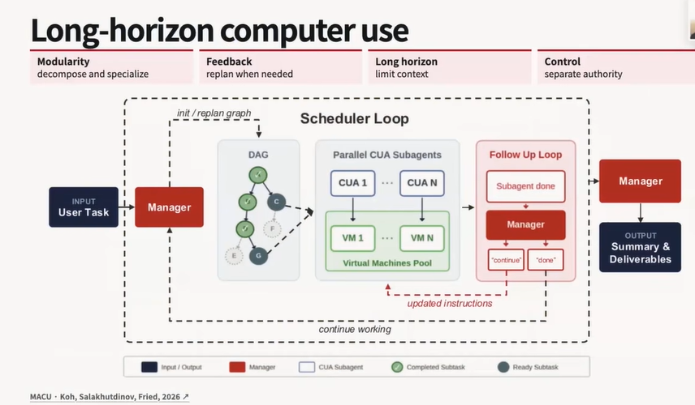
We can track the plan as a dag, carry out subtasks parallely and in an order, pass the info up and the manager has the ability to replan and inspect the results of the subtask. Can edit the dag plan as well, this process repeats until the full dag is complete. Weaker models get more help when they're employed by a manager and a stronger manager capabitliy also improces the overall performance without increasing the cost much because the weaker model is what does the work, which is the expensive part

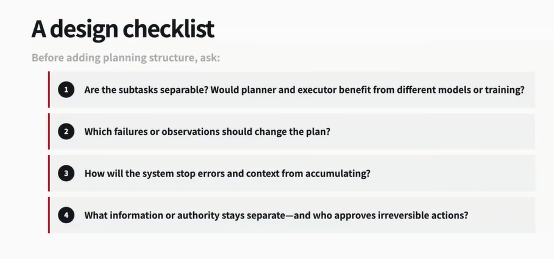