One off prompts that require writing codes to do something. For example, like generating bar graph or something, but its not limited to one off prompts but can involve a full repository and writing code from scratch, or fixing issues etc

Three things to keep in mind for generating/writing code in a single step (not agentic coding yet):
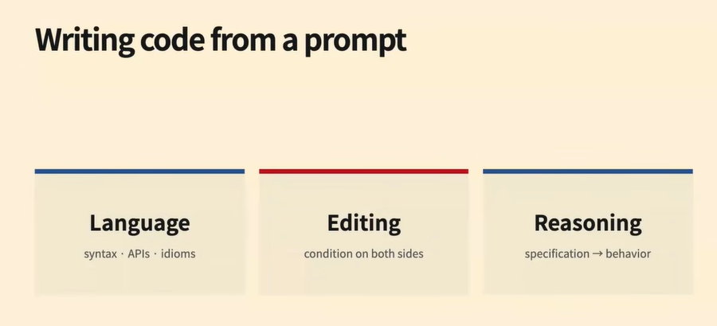

For a language model to generate code:
- All the tokens must exist in the tokenizer 
- Lot of coding data to train on, english to understand things and also the language of the code we are gonna use it
- Usually math is also included because it needs to think as well and improving logical reasoning capabilities

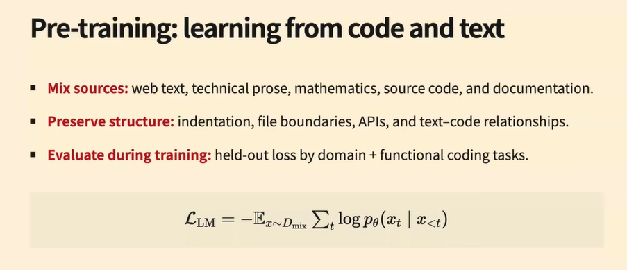

Cleaning data is also very important and more nuanced here because of syntax spaces etc 

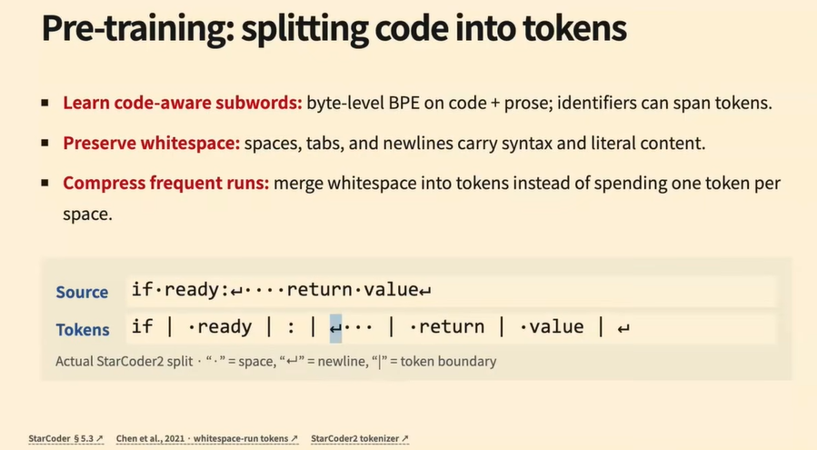

Very naive way to build long context data is to concat all the code files into a single long string. But doing it this way would exceed the context window of the model. So we have to build the context in a way that it can be fed to the model in chunks. Each string we'd build from the files of github repo into a coherent string by parsing the dependency graph etc and adding files so that enough context and coherence is present in it

Infilling: using code before and after the missing code to fill in the missing code. This helps bring the ability to infer types, rename variables, auto complete code, prepare comments etc

In addition to infilling, can use github tests + code pr acceptance data etc
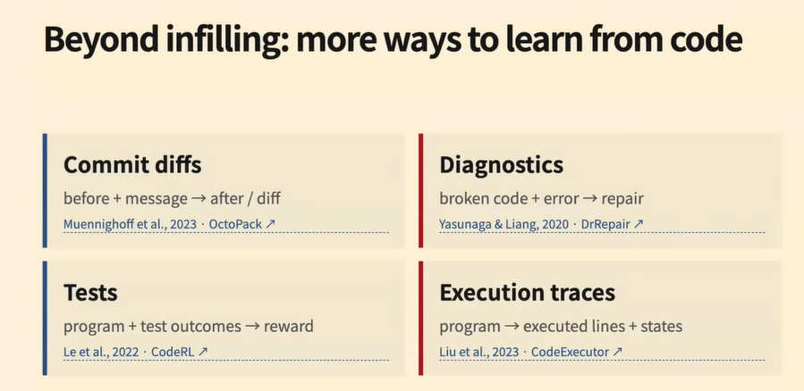

For eval, can use metrics like CodeBleu etc. CodeBLeu is a combination of token, ast and other match variants. EM, BLEU etc can also be used. Embedding based methods like CodeBertScore

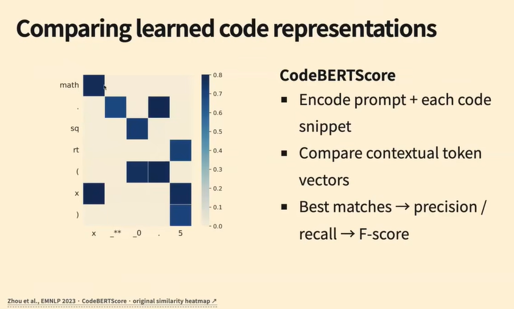

Ofc the typical and accurate way to measure the code is by running it and evaluating against test cases. However, creating tests that are reliable and not having both false positive and false negative examples is very difficult.

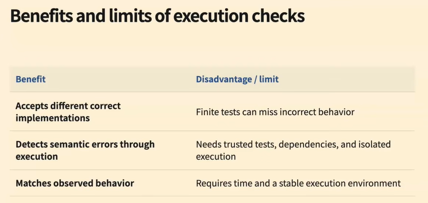

Evaluating coding efficiency is also important. Other things like maintainability, readability, security, performance, scalability, etc are also important. And for agentic tasks which writes a lot of code, efficiency becomes very important.

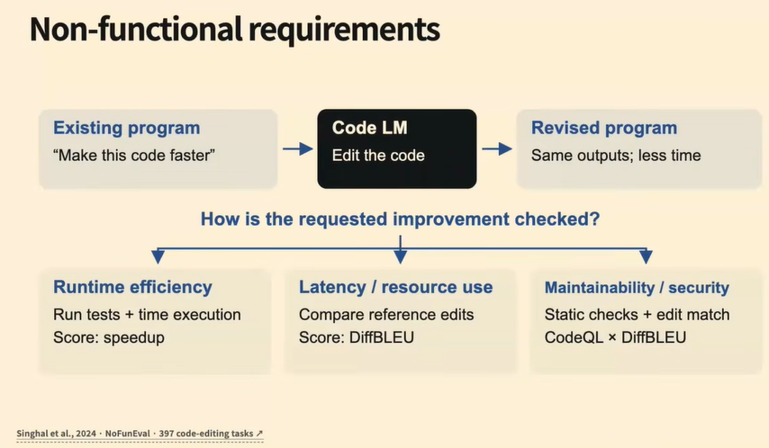

Comments getting written could be because:
- Existing code has comments, so it learns to write
- Writing comments to explain the code could in turn help the model because it spends more tokens and this will help in writing proper working code
- THere could be code comments' quality testing models

---
Agentic Coding

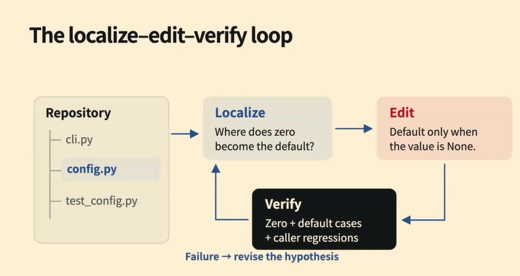

Coding tools: Bash commands or expose a bash tool (`ls, cd, cat, rg, pytest, build commands, sed, awk, python`)
    - Why this might not be enough? There's only a limited number of tools that it offers and exposing a single file edit tool would be more effective compared to using sed/awk because the model needs to take care and always think about which one to use and how to use it properly

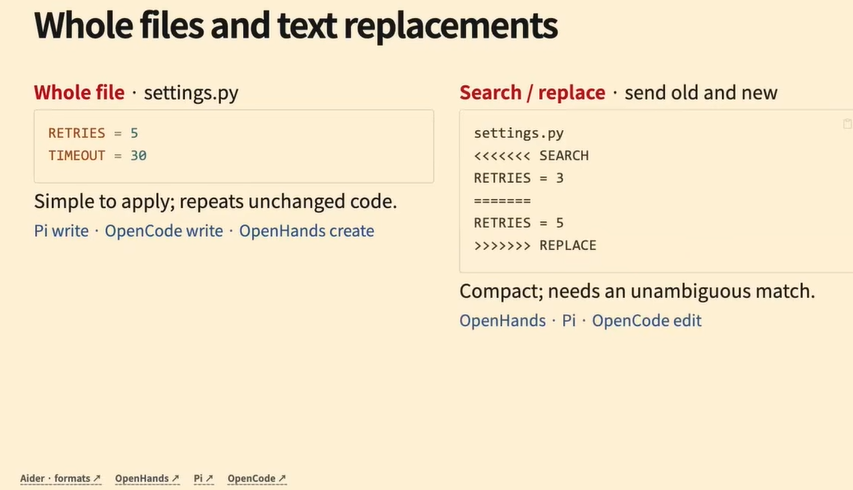
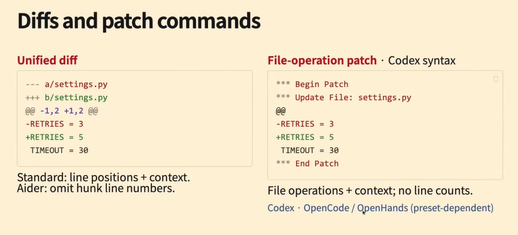

There's a disadvantage of using codex syntax file op where when we file operation patch, it could so happen that the lines of code could be present at multiple places in the file and to disambiguate which line, the model might have to output multiple lines to make the changes unambiguous. However, the advantages this type of tool offers outweighs the disadvantages and hence codex syntax style is preferred compared to the traditional diff.

Whatever tools the model has seen in the training data more, itll do better when equipped with those tools. But if it hasnt seen the tool, it wont be able to use it and hence might perform poorly.

`rg` (ripgrep) is preferred to `grep` because it's faster and more efficient and also supports regex.

Can equip it custom tools to make it work better, but it may not always be fruitful
We want pass to remain pass while we want the fail to become pass when trying to improve the model.
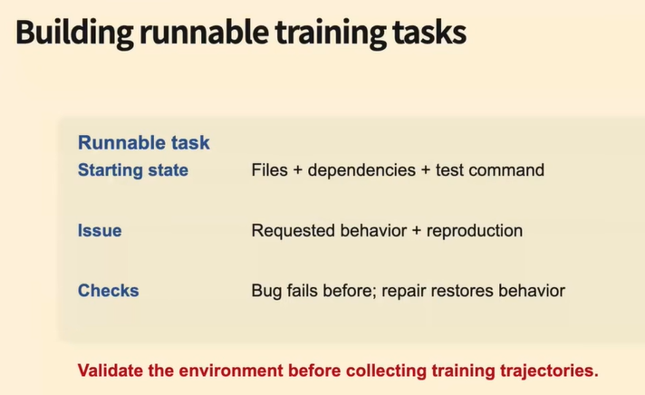

A software design principle aroudn testing tests is that if you know making changes to code at certain places shouldn't allow the code to pass, then we will make those changes and test the tests, if the tests still pass then there are issues with our test suite and we havve to improve our test suite

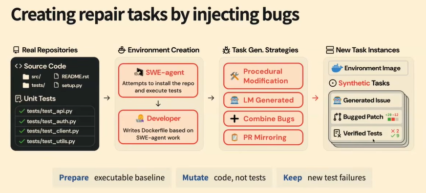

Since models would do worse when being tested against a harness on which it isnt trained on, there are efforts to train with lot of different harnesses

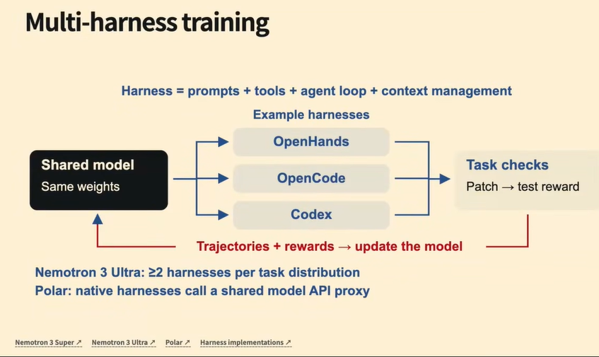

Using gui agents as a component of our harness to test frontend agents etc or writing scripts which run in browser etc. It doesnt need to be a multimodal model to do well in frontend tasks!!

Once we have paradigms, we can train specialised models to do each paradigm. For example, for localisation, we can create a specialised model to do localisation.
Other tasks like software maintanence, writing really good tests/test generation, CI repair etc

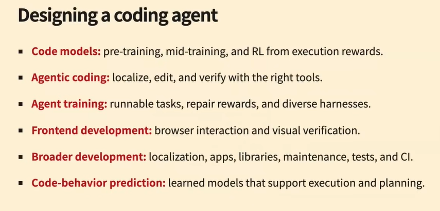