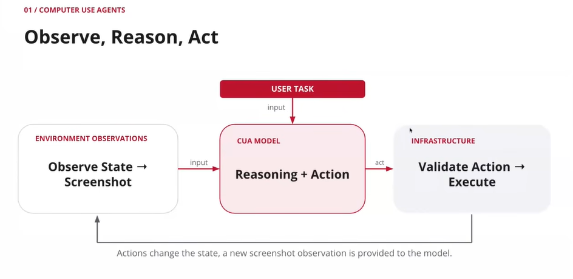
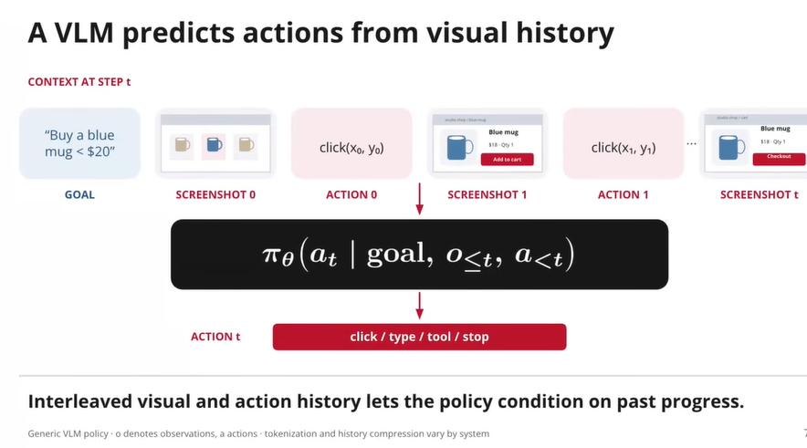
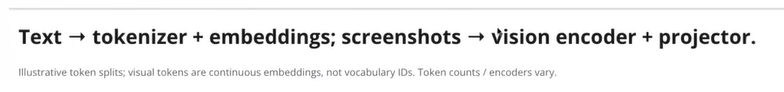
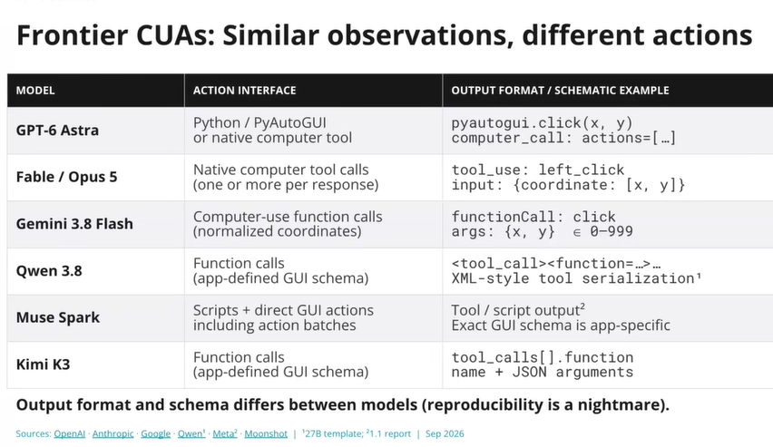
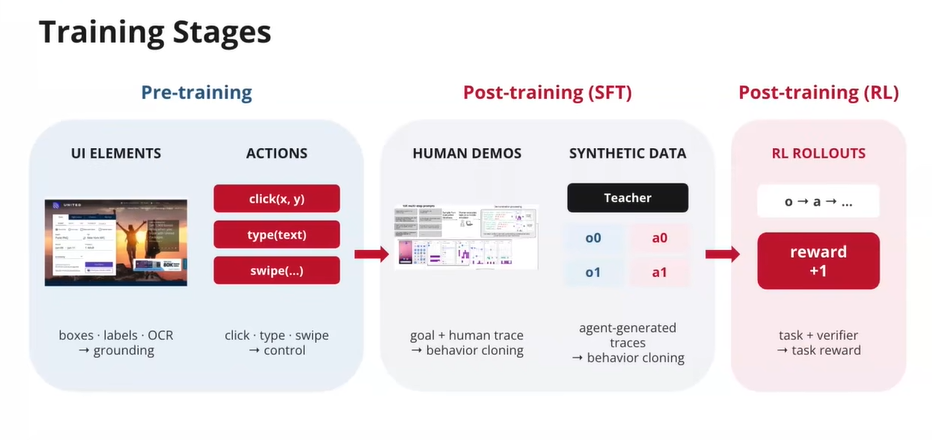
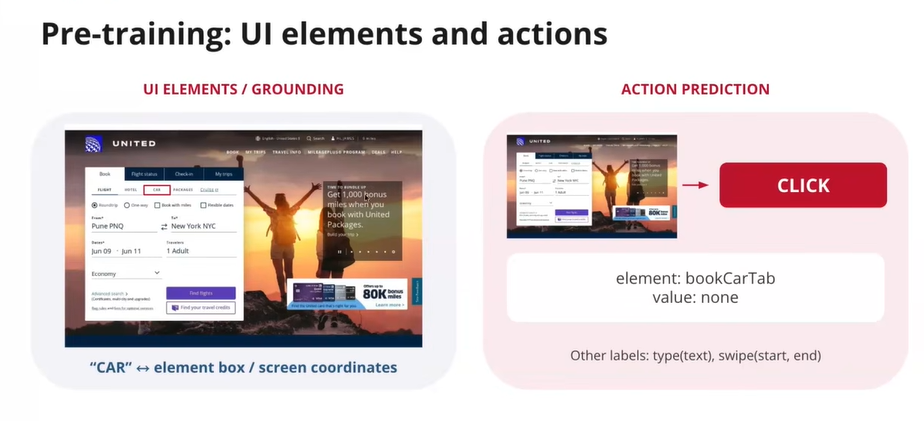
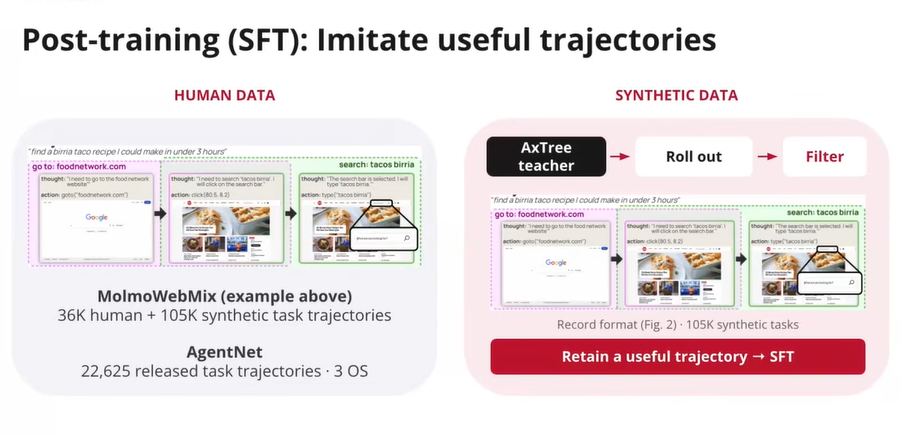

## Computer Use Agents
These are different from traditional agents like coding/normal text agents because they see gui as input and observe gui etc. Similar to how a human would use a computer, a computer use agent would use a computer like using ss, scrolling etc.

The same loop is used while training and reward is awarded based on the task completion success

Ofc openai is the pioneer here as well! And the paper dates back to 2017! They did a traditional rl like done in alphago
Now a days, we can generate the complete gui environments synthetically. For example, MyPCBench, CUA-World is a benchmark that's developed to test the gui agents etc

Eval is challenging for cua because there's no single way to verify like coding agents where we can measure the success by unit tests etc

- Static evals: we evaluate whether the agent step, which is the action, is correct or not. Usually there's no environment, its just a series of ss and predicting next actions, could be easy to maximise. THere can be multiple next possible actions that can be taken, so not having an exhaustive set of ground truth next actions makes it hard to evaluate
- End to End evals: We evaluate the end state, usually a simulated environment is present. We usually dont check for agent actions at individual steps, but rather the end state. To check the end state, usually a programmatic way is used. This could however lead to reward hacking when we dont penalise for its action but only consider the end state. Can use llm-as-a-judge type evaluation to check the trajectory for correctness mitigating reward hacking usually with bunch of rubrics etc. Can also use direct websites to test their navigation there but need to ensure it doesnt take any destructive actions or actions with cost. This can involve web, desktop, mobile, etc.

For long horizon, just awarding based on end result is very sparse. We do want to judge it based on intermediate tasks as well. So usually rubrics+trajectory evaluation is used. Long horizon involves mins to hour long tasks, for example, osworld 2.0 involves cad modelling and all which are very complex tasks and the agent should be able to sustain work for a long time.

Not just screenshots, sometimes models like gpt astra use some assessibility representations like xml etc which tell this area has this this area has that types thingy (mac provides this it seems). However, ss based trainig would be more generic and can be used for any task unlike when trained on some representatino which couldn't generalise

Action space depends on where we would wanna deploy the model

---
CUA is usually modeled by a vlm

Ofc we will not feed the pixels direclty, there'll be some tokenizer to tokenize the image and feed it into the modle

Different models have different action spaces

Ss based representation is preferred because it generalises better and simpler compared to other representations like xml, html etc and ss based representation also seemed to achieve better performance. If we see a loading screen (whcih is like an infra issue), the model might sleep till some extent, the models are trained to sleep or wait in these cases instead of continuous polling

During pre-training, the main goal is to instill the ablity of localisation and selectign next action like predicting the coordinates of clickable link etc

We want to learn the items on the page, where the items are present, how to address it and how to navigate the page

Do create synthetic data for posttraining, we can provide special privileged information like web html etc and use a model along with it to generate syntehtic traces and then train a model based on the ss only by imposing the actions the model with privileged information took.

Now we do rl after it has some abilities to refine those by giving rewards from the environment and updating the policy from the rewards. RL part is important for instilling and refining cua abilities over long horizons

And to do RL creating rl environments is essential

SOme things which still need improvements for cua
- Speed and cost
- Personalization
- Multi agent cua systems
- Infra and UX for agents