## SFT Agentic

Parameter training (weights) leads to changes in inherent behaviour

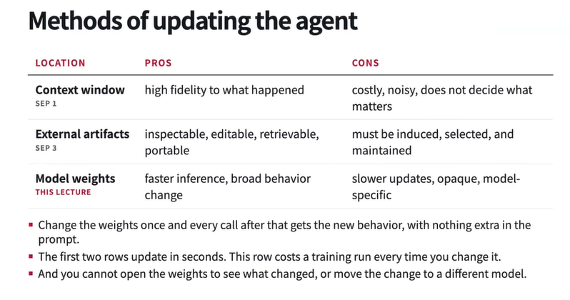
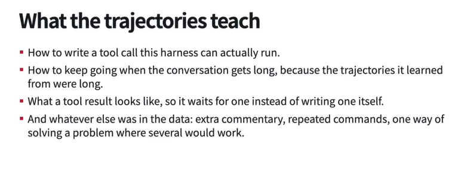

For PT and Mid training we can find large corpuses already available, even for sft to some extent but for rl and capability related training we need to build data for sft and environments for rl etc

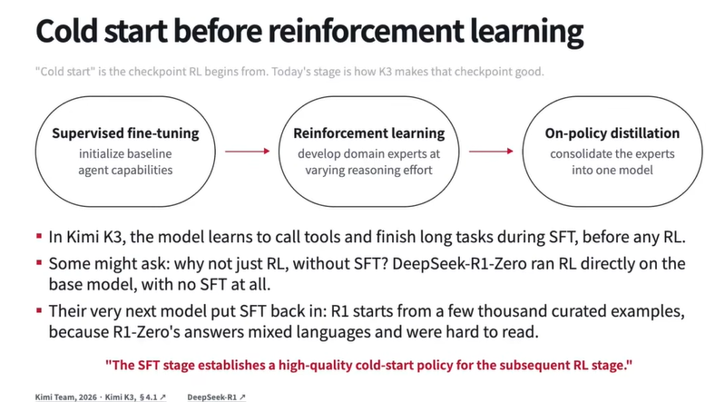

Chat template is applied to the full trajectory, which is dependent on the model which converts the full trajectory into a single string we can train on

In sft, we only train on assistant tokens and dont apply any loss on context (system/user prompt, tool call outputs etc). Mask is applied to the context tokens to avoid training on them.

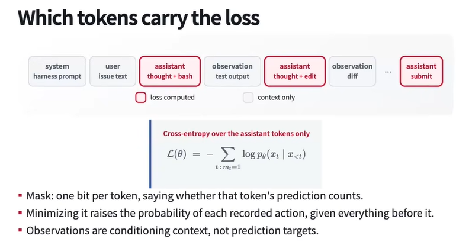
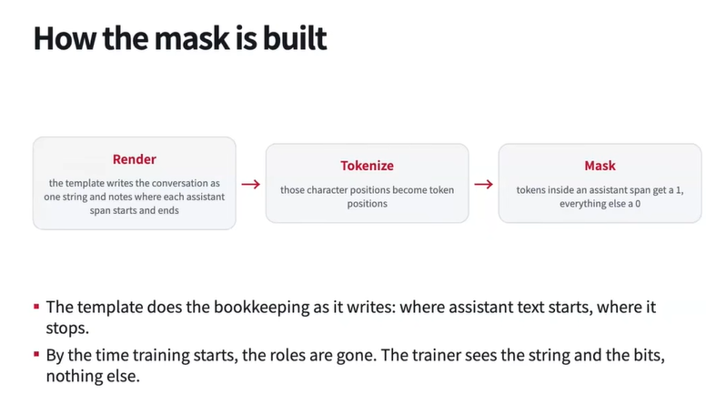

During posttraining and sft, keeping note on end of sequence token `eos` is essential to keep in mind because it will learn to output eos to end its turn and we will stop generating/sampling once we encounter this eos token.

Sometimes models are not trained on thinking trails and this is a model specific decision because training on long reasoning traces can potentially dominate the loss and model might not learn the important details like tool calling and reasoning on what action to take next

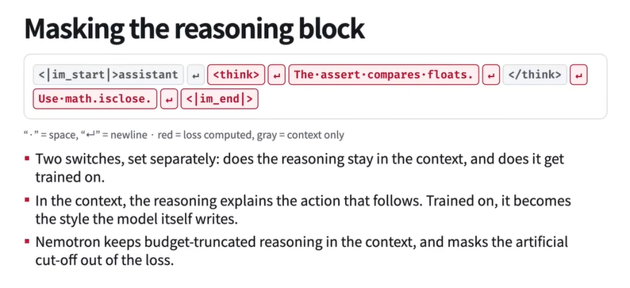

Counting number of samples of a specific domain might not be same as its token ratios! Need to judge mixes based on token ratios

Choosing trajectories for sft is important

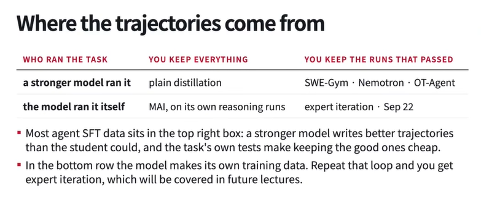

Need to filter bad trajectories and train on good ones only because we dont want to teach our agent bad behaviour. Filtering can be done based on number of turns etc and some out of the box filtering/quality assessing conditions. However, not every theoritically sound condition would work in practise
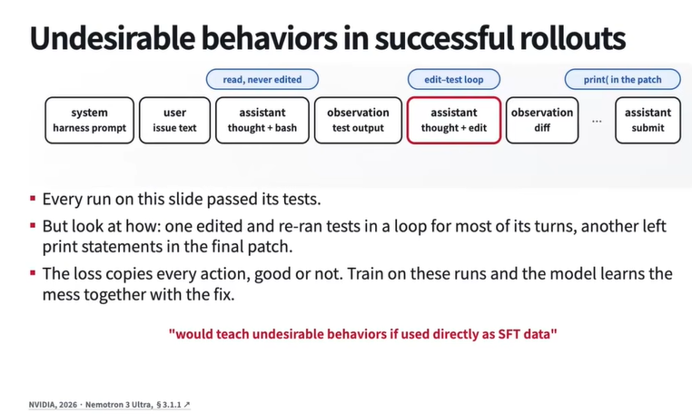
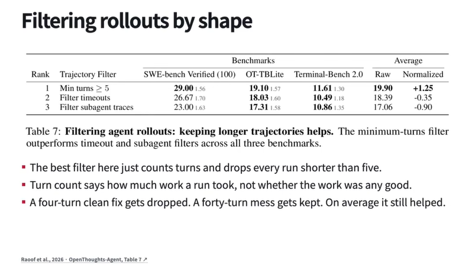

Stronger model $ \neq $ better teacher model because the generated trajectory might not work well to teach other models even though its good at solving the task at hand

Differnt training sources help at different downstream tasks, so that is a major thing that should be kept in mind while choosing training sources
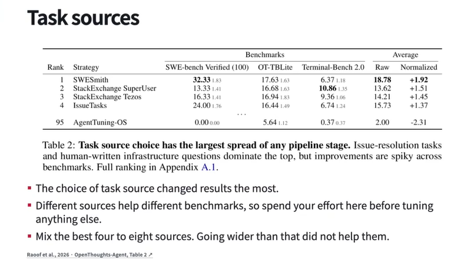

If we upsample from same rows from the same distribution, the performance might actually drop. Synthetic augmentation from differnt data distribution can help

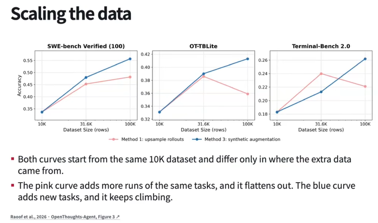

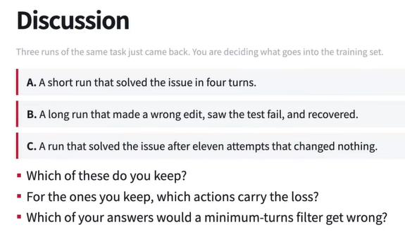
Nice Choosing B could help as it can teach recoverability but it may also happen that the agent might learn to do wrong edits and not learn recoverability. So it all depends on what we exactly wnat to teach the models

Combining various datasets to train on when there's heterogenity in the data format while saving could be cumbersome because we have to write custom scripts for each to convert them into a single format. There's also the headache of training harness specific because of different tool calls/actions, context compaction etc available with harnesses. 

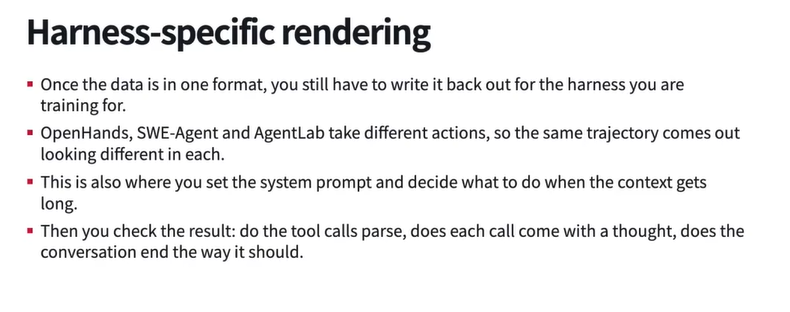

Improving diversity of the data helps improve downstream performance agisnt training with only the task specific data on the task

The sft configurations also change from model to mode, so have to take care and think about that as well.

Since most of these models are MoE based models, expert routing can come into play as during pre-trainig it could be evenly done while at sft since the data is much less diverse, most of the tokens could get routed via a few handful of experts

Packing

Tempalte we train with shoudl be the template we serve with, down to the whitespace because we dont want the model to drift drastically as it is very sensitev to the template its been trained on

Knowing sft worked?
Training and inference mismatch in terms of actions that it has to take, for example, it might not have learnt the ability to recover from mistakes or there's no such data during sft while in real world it does an edit and doesnt pass or gets an error because of the edit etc, now it doesnt know what it needs to do next since it hasnt seen about that during the data. Low training loss only tells training is going well but promises nothing other than that

Gotta observe both model loss and eval performance. If the model loss isnt going down, then there's definitely something wrong with the training process. If the eval performance is not improving, then there's something wrong with the data or the training process.

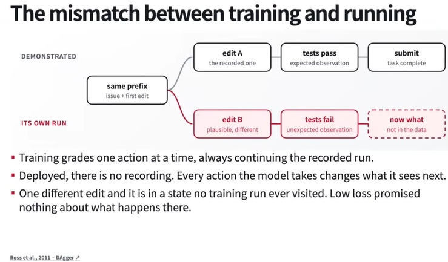
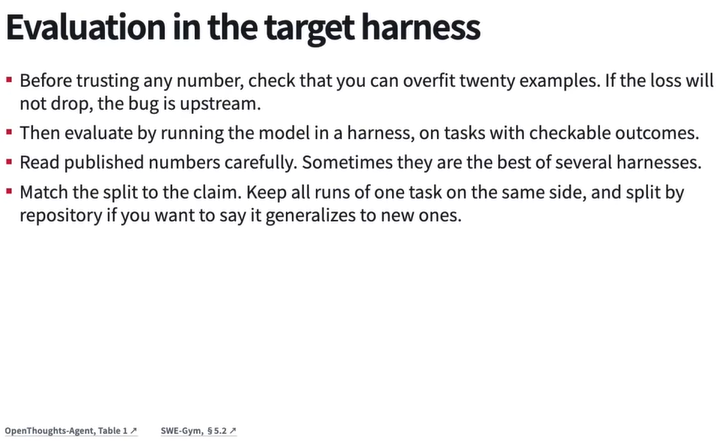

Sometimes these labs collect data from mulitple harnesses to avoid making the model sensitive to one harness implementation
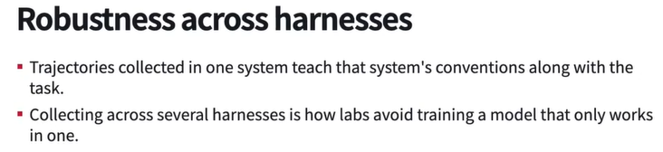

We shouldn't just evaluate only on the benchmark of our consideration, we should also evaluate on adjacent benchmarks as well to avoid benchmaxing on one benchmark

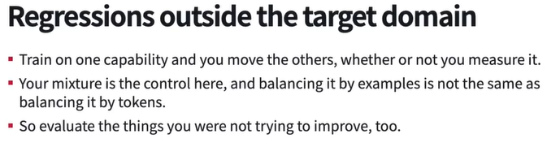

SFT helps gain more generic agentic capabitlies as a whole while rl is where we can build specialized skills and capabilities for a specific task

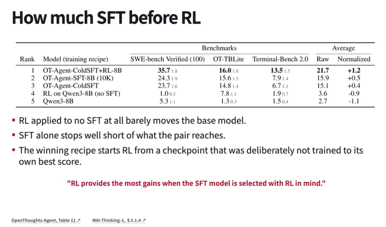

Supervising or reinforcing agents on trajectories which have wrong end result but possess corrective behaviour in teh trajectory may or may not help but can come to bite us back in the end because it might learn making mistakes and correcting them but not learn the correct behaviour to take next.
